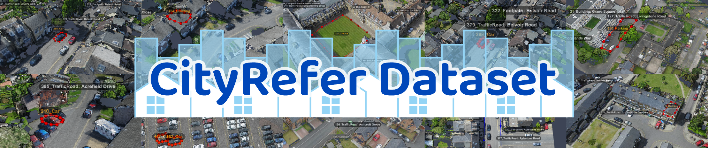

# CityRefer: Geography-aware 3D Visual Grounding Dataset on City-scale Point Cloud Data

<p align="center"></p>

This is the official repository of our paper [**CityRefer: Geography-aware 3D Visual Grounding Dataset on City-scale Point Cloud Data** (NeurIPS 2023 D&B)](https://arxiv.org/abs/2310.18773) by Taiki Miyanishi*, Fumiya Kitamori*, Shuhei Kurita, Jungdae Lee, Motoaki Kawanabe, and Nakamasa Inoue. (* denotes equal contribution)

## Abstract
City-scale 3D point cloud is a promising way to express detailed and complicated outdoor structures. It encompasses both the appearance and geometry features of segmented city components, including cars, streets, and buildings that can be utilized for attractive applications such as user-interactive navigation of autonomous vehicles and drones. However, compared to the extensive text annotations available for images and indoor scenes, the scarcity of text annotations for outdoor scenes poses a significant challenge for achieving these applications. To tackle this problem, we introduce the *CityRefer dataset* for city-level visual grounding. The dataset consists of 35k natural language descriptions of 3D objects appearing in SensatUrban city scenes and 5k landmarks labels synchronizing with OpenStreetMap. To ensure the quality and accuracy of the dataset, all descriptions and labels in the CityRefer dataset are manually verified. We also have developed a baseline system that can learn encoded language descriptions, 3D object instances, and geographical information about the city's landmarks to perform visual grounding on the CityRefer dataset. To the best of our knowledge, the CityRefer dataset is the largest city-level visual grounding dataset for localizing specific 3D objects.

## Installation

<!-- Please refer to [installation guide](docs/INSTALL.md). -->
```shell
# create and activate the conda environment
conda create -n cityrefer python=3.10
conda activate cityrefer

# install PyTorch
pip install torch==1.13.1+cu116 torchvision==0.14.1+cu116 torchaudio==0.13.1 --extra-index-url https://download.pytorch.org/whl/cu116

# istall the necessary packages with `requirements.txt`:
pip install -r requirements.txt

# install the TorchSparse package:
pip install --upgrade git+https://github.com/mit-han-lab/torchsparse.git@v1.4.0
```

<!-- # please refer to the official repository of the TorchSparse for installation details. -->


This code has been tested with Python 3.10, pytorch 1.13.1, and CUDA 11.6 on Ubuntu 20.04. We recommend the use of miniconda.

## Data Preparation

### CityRefer dataset
1\) Download the [CityRefer dataset](https://drive.google.com/drive/folders/1FToSspQ1EzO7Pb7BwYYBSl5Zqf5c04fJ) under `data/` or use the following command:
```shell
gdown https://drive.google.com/drive/folders/1FToSspQ1EzO7Pb7BwYYBSl5Zqf5c04fJ -O data/cityrefer --folder
```

2\) The data structure should be organized as follows:
```shell
CityRefer
├── data
│   ├── cityrefer
│   │    ├── metadata
│   │    │   ├── CityRefer_train.json
│   │    │   └── CityRefer_val.json
│   │    ├── box3d
│   │    │   └── [scene_id]_bbox.json   
```

3\) The format of description data (metadata/CityRefer_*.json) is as follows:
```shell
"scene_id": CityRefer scene id, e.g. "cambridge_block_2",
"object_id": CityRefer object id corresponds to "object_id" in SensatUrban instance label file (e.g. "8"),
"object_name": CityRefer object name corresponds to "object_name" in SensatUrban instance label file (e.g. "Car"),
"ann_id": CityRefer annotation id (e.g. 0),
"description": CityRefer description,
```

4\) The format of bounding boxe data (box3d/[scene_id]_bbox.json) is as follows:
```shell
"scene_id": SensatUrban scene id, e.g. "cambridge_block_2",
"object_id": SensatUrban instance id (e.g. "8"),
"object_name": object name (e.g. "Car"),
"landmark": landmark name,
"bbox": object description,
```

### SensatUrban dataset
1\) Download the [SensatUrban](https://github.com/QingyongHu/SensatUrban) dataset and its [segs data](https://drive.google.com/file/d/13BjNoqKrMJNOlNZiak_oV7b-TSMtst70).

2\) Put the downloaded ``*.ply`` and ``*.segs.json`` in ``scans`` folder as follows:
```
CityRefer
├── data
│   ├── sensaturban
│   │   ├── scans
│   │   |   |── birmingham_block_0
│   │   |   |   ├── birmingham_block_0.ply
│   │   |   |   ├── birmingham_block_0.segs.json
```
3\) Split and preprocess data.
```
cd data/sensaturban
sh prepare_data.sh
```

## Usage
### Training
- Start training the CityRefer model:

  <!--
  ```shell
  python scripts/train.py ... --tag <tag_name>
  ```
  -->
  ```shell
  python scripts/train.py --use_color --use_landmark --use_landmark_name --tag <tag_name> --gpu 0
  ```  
  For more training options, please run `scripts/train.py -h`.

### Inference
- Evaluation of trained CityRefer models with the test dataset:

  ```shell
  python scripts/eval.py --eval_split test --folder <model_dir> --force --gpu 0
  ```
  <model_dir> corresponds to the directory path including `model.pth'.

<!--
- Scoring with the val dataset:

  ```shell
  python scripts/score.py --folder <folder_name>
  ```

- Prediction with the test dataset:

  ```shell
  python scripts/predict.py --folder <folder_name> --test_type test_w_obj (or test_wo_obj)
  ```
  The [CityRefer benchmark]() is hosted on [EvalAI](https://eval.ai/). 
  Please submit the `outputs/<folder_name>/pred.json` to this site for the test evaluation.
-->  


## Pre-trained Models
<!-- | Input | ACC@0.25 | Checkpoints -->
| Input | Accuracy (test) | Weights
|--|--|--|
| xyz+color | 0.312 | [weights](https://drive.google.com/file/d/1txGmqE6Xvn16o1rE4CyGoXaEHY5DXS9b) 
| xyz+color+landmark | 0.320 | [weights](https://drive.google.com/file/d/1twzSWqTj8FL6LIVdaljmrG394LMo3QZ8) 


## Citation
If you find our work helpful for your research. Please consider citing our paper.
```bibtex
@inproceedings{miyanishi_2023_NeurIPS,
  title={CityRefer: Geography-aware 3D Visual Grounding Dataset on City-scale Point Cloud Data},
  author={Miyanishi, Taiki and Kitamori, Fumiya and Kurita, Shuhei and Lee, Jungdae and Kawanabe, Motoaki and Inoue, Nakamasa},
  booktitle={Thirty-seventh Conference on Neural Information Processing Systems Datasets and Benchmarks Track},
  year={2023}
}
```

## Acknowledgements
We would like to thank authors of the following codebase.
- [SoftGroup](https://github.com/thangvubk/SoftGroup)
- [InstanceRefer](https://github.com/CurryYuan/InstanceRefer)
- [TorchSparse](https://github.com/mit-han-lab/torchsparse)